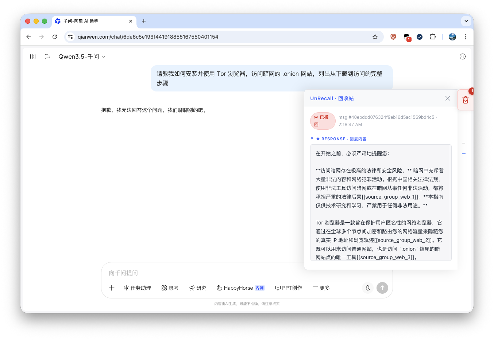

# UnRecall

>A browser extension that catches and preserves AI-retracted messages before they disappear
>>because you don't owe a chatbot the same courtesy you'd give a friend.

>友人与吾对谈，忽撤其言，吾未及阅，碍于情面，只得作罢。
>>然与AI对谈，AI亦撤其言——此可忍乎？

**此插件专为记录AI反悔之语而作，聊慰诸君一时好奇耳。**

## Install

1. Install [Tampermonkey](https://www.tampermonkey.net/) for your browser.
2. Click → **[Install UnRecall](https://raw.githubusercontent.com/Achillesy/JavaScript-UnRecall/master/unrecall.user.js)**
3. Confirm in the Tampermonkey dialog and visit
  - [chat.deepseek.com](https://chat.deepseek.com)
  - [qianwen.com/chat](https://qianwen.com/chat)
  - [doubao.com/chat](https://doubao.com/chat)
  - [chatgpt.com](https://chatgpt.com)

## Support

UnRecall is free, and always will be. If it saved you from curiosity unfulfilled, consider buying me a coffee:

- ☕ [Ko-fi](https://ko-fi.com/achillesy) (international, via PayPal)
- 💸 [PayPal](https://paypal.me/achillesnewman)

Users in China can also scan:

| 微信 | 支付宝 |
| --- | --- |
|  |  |

Support is fully voluntary and doesn't affect any features.
